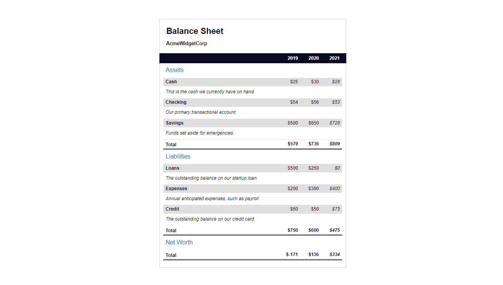

## FreeCodeCamp - Balance Sheet

## Table of contents

- [Overview](#overview)
  - [The challenge](#the-challenge)
  - [Screenshot](#screenshot)
  - [Links](#links)
- [My process](#my-process)
  - [built with](#built-with)
  - [What i learned](#what-i-learned)
- [Acknowledgements](#acknowledgements)

## Overview

### The challenge

Users should be able to:

- View the optimal layout depending on their device's screen size.
- See interactive elements.

### Screenshot

### Links

- Live Site URL: [Balance Sheet]( https://muhdal-amin.github.io/penguin-app/)

## My process

### Built with

- HTML5
- CSS3

### What i learned

- CSS clip paths
- CSS :first-of-type, :last-of-type selectors and :nth-of-type selectors
- CSS [attribute~=value] selector

## Acknowledgements

Challenge and Style guide by [FreeCodeCamp.org](https://www.freecodecamp.org/)